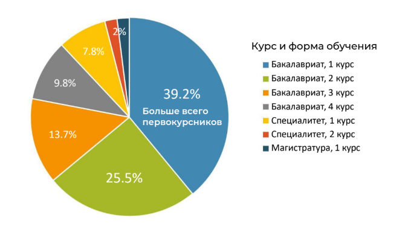
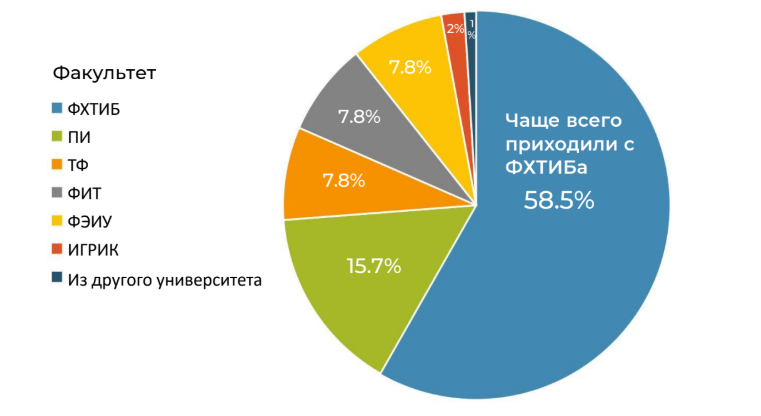
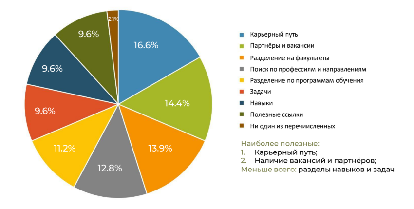
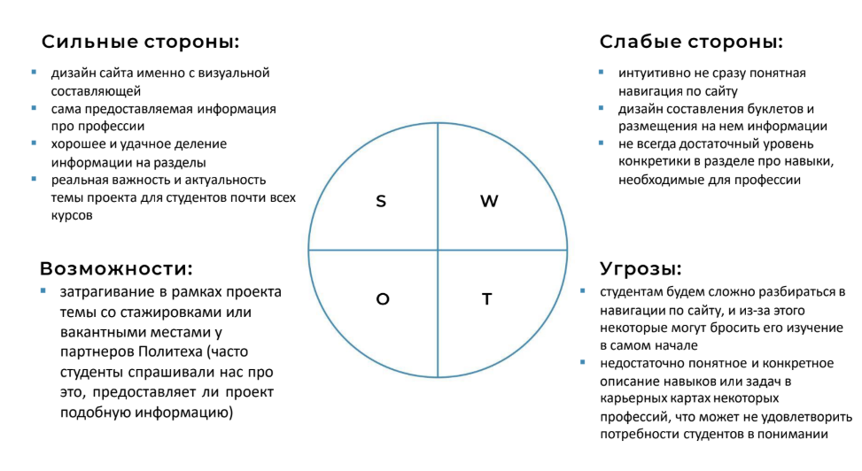

Среди студентов был проведен опрос о сайте.

Всего прошли 51 человек.

## Что оказалось наиболее полезным для студентов разных курсов

1 и 2 курсы чаще делали акцент на
разделе с партнёрами Политеха и на
наличии вакансий, отмечая для себя
необходимость в поиске работы.

3 и 4 курсы: чаще всего указывали на
полезность проекта в рамках понимания
своей специальности и профессии и
своего карьерного будущего.


  * Студентам было легко найти информацию на сайте, и сложностей
особо не возникало.
* Однако на самом карьерном марафоне они довольно часто не
могли быстро и самостоятельно разобраться, куда нажимать, чтобы
перейти в перечень профессий или на саму карьерную карту.


## Студенты каких факультетов поучаствовали в опросе

## Какие разделы сайта оказались наиболее полезными

## Оценка качества предоставленной на сайте информации

## Выводы

